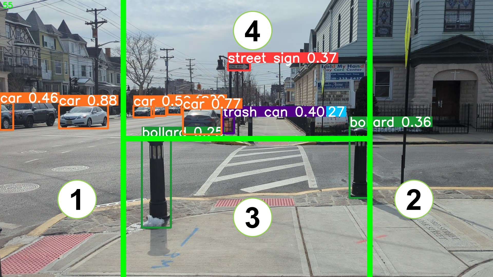

# H-Splitter: Anomaly Detection for Enhanced Navigation

See our another project for the practical implementation and testing:
<a href="https://github.com/AIS-Clemson/VisionGPT">AIS-Clemson/VisionGPT</a>

## Overview
This project introduces an advanced anomaly detection system designed to improve navigation safety for visually impaired individuals and robotic navigation systems. At the heart of this system is an innovative image processing technique that employs an 'H' pattern segmentation, analyzing real-time imagery to accurately identify and categorize potential hazards.

## H-Pattern Segmentation
The 'H' pattern segmentation method divides the captured image into four strategic regions: **Left**, **Right**, **Front**, and **Ground**. This spatial categorization facilitates a nuanced understanding of the environment, enabling the system to focus on areas of interest and ignore irrelevant detections. The segmentation works as follows:

- **Left/Right**: Occupying the outer 25% on either side of the image, these regions are pivotal for detecting moving objects such as vehicles or cyclists that could pose lateral threats.
- **Front**: The central 50% of the image, extending vertically in the upper half, focuses on distant objects directly ahead, aiding in long-range navigation planning.
- **Ground**: This area covers the central 50% widthwise and the lower half vertically, highlighting objects on or near the ground that could present immediate obstacles.

## Image Processing Techniques
To enhance the accuracy and reliability of object detection, the system incorporates sophisticated image processing techniques, including stabilizers and frame compensation. These methods ensure that environmental analysis remains consistent and accurate, even in dynamic or unstable conditions. Key features include:

- **Image Stabilization**: Counteracts camera shake and motion blur, ensuring that object detection is based on stable and clear imagery.
- **Frame Compensation**: Adjusts for rapid scene changes or object movements, maintaining accurate object categorization and positional tracking over time.

## Anomaly Detection and Alerts
Anomalies trigger alerts for objects detected in the 'Ground' area or those occupying significant space in the 'Left' or 'Right' regions. By focusing on these critical areas, the system efficiently identifies potential navigation hazards. Alert generation is based on object characteristics such as size (objects occupying >10% of the region), position, and movement patterns, providing users with actionable information.

## Contributions and Feedback
We welcome contributions and feedback to improve the H-Pattern Anomaly Detection system. Please feel free to open issues or submit pull requests with enhancements, bug fixes, or suggestions. Let's work together to make navigation safer for everyone.

