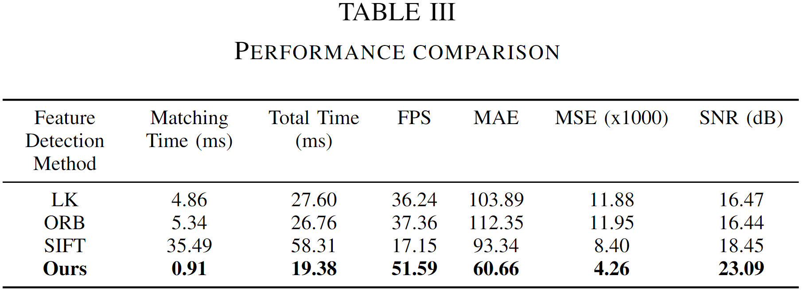

# Ego-Motion Prediction with All-Pixel Matching 

## Overview

This project introduces Motor Focus -- a lightweight, image-based framework designed to predict ego-motion, i.e., the movement intentions of humans (or humanoid machines), using visual input while filtering out camera motion without the need for camera calibration. The framework implements an optical flow-based pixel-wise temporal analysis to account for camera movement, enhanced by a Gaussian aggregation to smooth the predicted movement area.

    

## Background
Assistive visual navigation systems for visually impaired individuals have gained popularity with the advent of mobile computing. These systems typically translate visual information into voice commands, enabling users to navigate complex environments. However, in scenarios with multiple objects, it becomes crucial to prioritize object detection and provide timely notifications for key entities based on their direction. One of the core challenges is identifying the user's movement direction (ego-motion) solely from visual data—a gap that this project addresses.

## Features
Our framework mainly predicts ego-motion by identifying how users physically orient themselves in space through pixel-wise temporal analysis. 

- **Video Stabilization**: To counteract camera shake, we used SVD and optical flow to estimate the affine transformation matrix from feature points extracted in two consecutive frames.
- **Camera Motion Compensation**: The fusion of two consecutive frames filters the camera motion, which highlights the object that moves relatively with the observer.

    

## Results
To evaluate the performance of Motor Focus, we collected a custom dataset to test the accuracy, robustness, and efficiency. As shown below, the advantage of our method among others is the key points matching time.

    

- **Fast & Efficient**: Capable of over 50 FPS, our framework is optimized for real-time applications on mobile devices.
- **Accurate**: The method achieves an MAE of 60 pixels and SNR of 23 dB, outperforming existing techniques.
- **Robust**: Filters out unintended camera movements to focus solely on the observer's motion.

## Demo

### Biking in the narrow street:

    

### Street walk:

    

    

## Contributions and Feedback
We welcome contributions and feedback to improve the H-Pattern Anomaly Detection system. Please feel free to open issues or submit pull requests with enhancements, bug fixes, or suggestions. Let's work together to make navigation safer for everyone.

### Original contribution:
- Jiayou Qin (Stevens Institute of Technology)
- Hao Wang (Clemson)

### Related Work:

See another project for the practical implementation and testing:
<a href="https://github.com/AIS-Clemson/VisionGPT" target="_blank">AIS-Clemson/VisionGPT</a>

    

